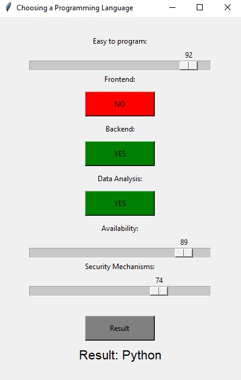
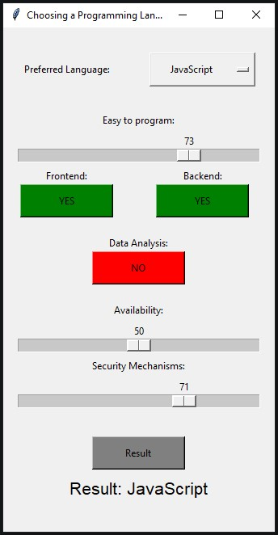

# Inference System for Selecting the Optimal Programming Language

Project for completing the course "Intelligent reasoning systems"

## Release 1 (19.11.2023)
### UI:

### Features:
- User can set "Easy to program" slider from 0 to 100,
- User can set "Frontend" button if want to predict frontend language,
- User can set "Backend" button if want to predict backend language,
- User can set "Data Analysis" if want to predict data Analysis language,
- User can set "Availability" slider from 0 to 100,
- User can set "Security Mechanisms" slider from 0 to 100

## Release 2 (22.11.2023)
### UI:

### Features:
- User can set "Preferred Language" in Option Menu to set double weight in prediction
