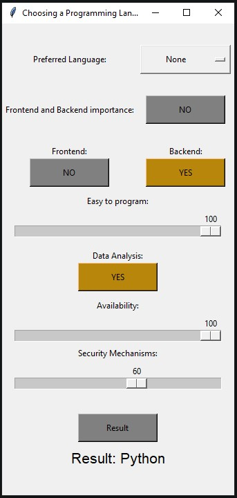

# Inference System for Selecting the Optimal Programming Language

Project for completing the course "Intelligent reasoning systems"

## Documentation
<a href="https://wolanin00.github.io/Inference-System-for-Selecting-the-Optimal-Programming-Language/index.html" target="_blank">Inference System for Selecting the Optimal Programming Language’s documentation</a>

## Installation
Create conda env with Python 3.9 version -> `conda create --name my_env python=3.9`

Activate conda env -> `conda activate my_env`

Go to root folder and install all dependencies -> `pip install -r requirements.txt`

Go to root folder and run `main.py` file -> `python main.py`

## Building documentation locally
Go to `cd docs` folder

Run command -> `make clean & make html`

Go to `cd _build/html` folder and open `index.html` file on your preferred browser.

## Tests
To run tests go to main folder and run command -> `pytest`

## Release 1 (19.11.2023)
### UI:

### Features:
- User can set "Easy to program" slider from 0 to 100,
- User can set "Frontend" button if want to predict frontend language,
- User can set "Backend" button if want to predict backend language,
- User can set "Data Analysis" if want to predict data Analysis language,
- User can set "Availability" slider from 0 to 100,
- User can set "Security Mechanisms" slider from 0 to 100

## Release 2 (22.11.2023)
### UI:

### Features:
- User can set "Preferred Language" in Option Menu to set double weight in prediction

## Release 3 (16.12.2023)
### UI:

### Features:
- changing UI colors to more subdued,
- add 'Frontend and Backend importance' button,
- update algorithm into SVC (Support Vector Classifier)
